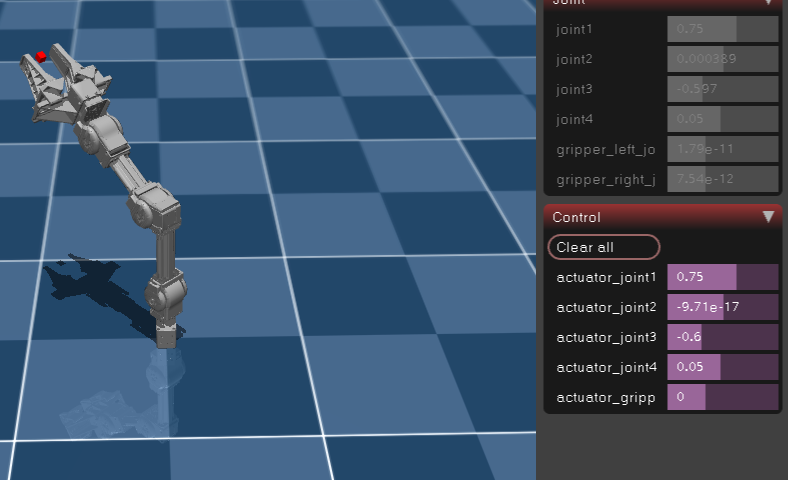
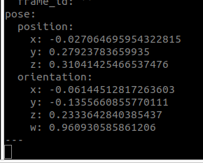

# VR Teleoperation System for OpenManipulator-X

## 시스템 개요

본 시스템은 VR 컨트롤러의 자연스러운 움직임을 로봇의 관절 각도로 변환하여 직관적인 로봇 제어를 구현합니다.

### Single Arm 시스템
- **bridge_single.py**: VR 브릿지 (Docker/ROS1)
- **mujoco_single.py**: MuJoCo 시뮬레이션
- **mirror_single.py**: 실제 로봇 제어 (Host/ROS2)

### Dual Arm 시스템
- **bridge_dual.py**: VR 브릿지 (Docker/ROS1)
- **mujoco_dual.py**: MuJoCo 시뮬레이션
- **mirror_dual.py**: 실제 로봇 제어 (Host/ROS2)

양팔 모두 실행 방식은 동일합니다.
1. 메타퀘스트2 quest2ros앱을 통해 도커 컨테이너로 pose값 보내는거 확인 후 브릿지파일 실행합니다.
2. 호스트에서 mujoco 시뮬레이션 실행합니다.
3. 하드웨어 연결 후 초기자세로 고정 시킵니다.
4. 메타퀘스트 버튼 2개 눌러 캘리브레이션시켜 무주코에서도 초기자세인걸 확인하고 미러링 코드를 실행합니다.
## Joint-Pose 매핑 방법론

### 핵심 개념: Offset-based Control

기존의 복잡한 역기구학(IK) 대신, VR 컨트롤러와 로봇 간의 **상대적 위치 변화**를 활용한 제어 방식입니다.

### 매핑 예시


*목표 위치에서의 mujoco환경에서의 joint값*


*목표 위치에서의 메타퀘스트 컨트롤러 pose값*

#### 1. VR 컨트롤러 위치 추적
```python
# VR 컨트롤러 6DOF 데이터
controller_pose = {
    'position': [x, y, z],      # 미터 단위
    'orientation': [qx, qy, qz, qw]  # 쿼터니언
}
```

#### 2. 상대 위치 계산
```python
# 캘리브레이션 시점 저장
calibration_pose = current_controller_pose

# 실시간 오프셋 계산
offset = current_pose - calibration_pose
```

#### 3. 관절 각도 변환
```python
# 위치 변화를 관절 각도로 매핑
joint_angles = [
    joint1: arctan2(offset.y, offset.x),           # 베이스 회전
    joint2: -offset.z * scale_factor,              # 숄더 피치
    joint3: distance_to_angle(offset.magnitude),   # 엘보우
    joint4: controller_orientation.pitch           # 리스트
]
```

### 매핑 범위

| 관절 | 최소값 | 최대값 | VR 매핑 범위 |
|------|--------|--------|--------------|
| Joint1 | -2.827 rad | 2.827 rad | 좌우 ±50cm |
| Joint2 | -1.571 rad | 1.571 rad | 상하 ±30cm |
| Joint3 | -1.396 rad | 1.571 rad | 전후 40cm |
| Joint4 | -2.827 rad | 2.827 rad | 손목 회전 |


## 성능 지표

- **제어 주기**: 50Hz (20ms)
- **지연 시간**: < 100ms
- **위치 정확도**: ±5mm
- **각도 정확도**: ±2°


## 통신 구조

```
Meta Quest 2 → [USB] → Docker(ROS1) → [TCP:12345] → MuJoCo
                                    ↘
                                     [TCP:12346] → ROS2 → Robot
```

### 데이터 포맷
```json
{
  "timestamp": 1234567890.123,
  "left_arm": {
    "joints": [0.0, 0.5, -0.3, 0.0],
    "gripper": 0.0
  },
  "right_arm": {
    "joints": [0.0, -0.5, 0.3, 0.0],
    "gripper": 0.0
  }
}
```
